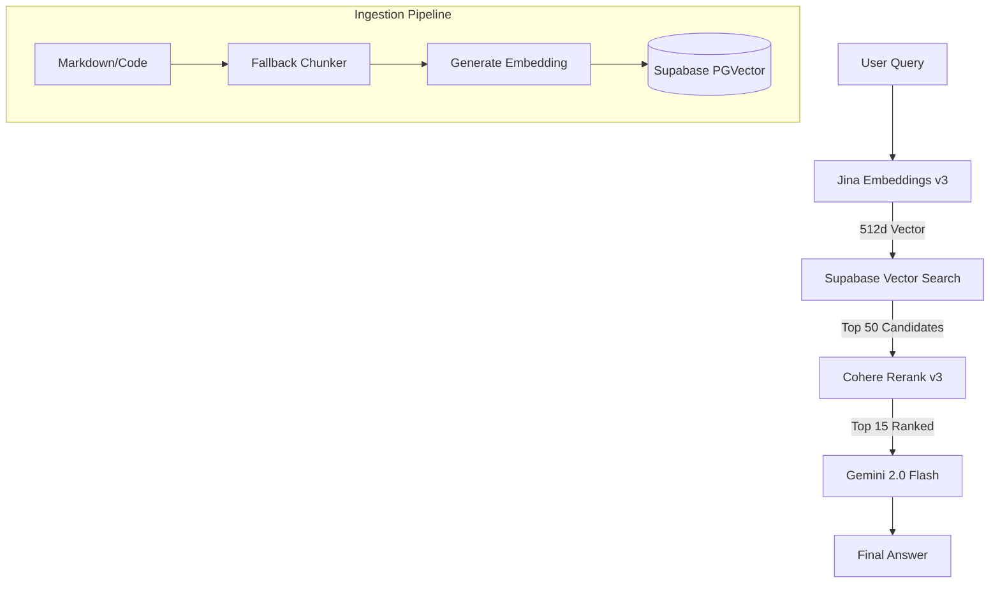

# Next-Gen RAG System Overview

**Status**: Deployed (v1.0)
**Date**: January 2026
**Architecture**: Hybrid Search (Vector + Rerank)

## 1. System Architecture

The Quoth RAG system enables semantic search over code and documentation using a state-of-the-art "Two-Stage Retrieval" pipeline.



## 2. Key Components

### A. Embeddings (Jina AI)
- **Model**: `jina-embeddings-v3`
- **Dimensions**: **512** (Optimized via Matryoshka Representation Learning)
- **Why**: Superior performance on code and technical jargon vs Google's generic text model.
- **Config**: `src/lib/ai.ts`

### B. Vector Database (Supabase)
- **Table**: `document_embeddings`
- **Index**: HNSW (Hierarchical Navigable Small World) for fast approximate nearest neighbor search.
- **Schema**:
  ```sql
  embedding vector(512) -- Jina optimized size
  metadata jsonb        -- Stores chunk origin
  ```

### C. Reranking (Cohere)
- **Model**: `rerank-english-v3.0`
- **Logic**: Re-scores the top 50 vector results based on deep semantic relevance to the query.
- **Trust Score**: Results are tagged as `HIGH`, `MEDIUM`, or `LOW` trust for the LLM.

### D. Ingestion (Chunking)
- **Current Mode**: **Fallback (Header/Text Split)**
- **Status**: AST (Abstract Syntax Tree) chunking is implemented but **temporarily disabled** due to Vercel build infrastructure limitations with WASM.
- **File**: `src/lib/quoth/chunking.ts`

## 3. Operations Manual

### Environment Variables
Ensure `.env.local` contains:
```bash
NEXT_PUBLIC_SUPABASE_URL=...
SUPABASE_SERVICE_ROLE_KEY=...
JINA_API_KEY=...       # Required for embeddings
COHERE_API_KEY=...     # Required for reranking
GEMINIAI_API_KEY=...   # Required for LLM generation
```

### Database Migration
If not already run:
```bash
# Apply the vector size update (768 -> 512)
psql $DB_URL -f supabase/migrations/018_update_vector_size.sql
```

### Re-indexing Content
Required after DB migration or major content updates:
```bash
npm run reindex
```
*This fetches all documents, generates new 512d embeddings, and updates the database.*

### Verification
To test the pipeline connectivity:
```bash
npm run verify:rag
```

## 4. Maintenance & Roadmap

- **Phase 1.1 (AST)**: Re-enable `web-tree-sitter` once the WASM build process is configured for Vercel.
- **Monitoring**: Check Supabase logs for `match_documents` performance.
- **Costs**: Jina and Cohere inputs are billed per token. Monitoring usage via their respective dashboards is recommended.
